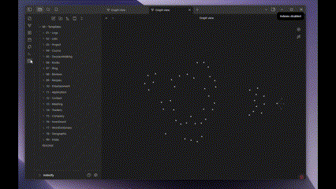

Vault Folder index creator for Obsidian

Creates indexes, linking the root tree with sub-indexes to create a tree structure, which will display as a tree-graph, showing all the folder relations in graph mode.

In this video you can see how the graph is created:

To do this examples I have used the Template collection vault of [llZektorll](https://github.com/llZektorll). 
- [GitHub repo](https://github.com/llZektorll/OB_Template)
